

# Wirecloud - SmartMaaS 2019 platform

Repository to store and document the visualization in the FIWARE Wirecloud component for the SmaartMaaS 2019 platform [https://dashboards.2019.smartmaas.services](https://dashboards.2019.smartmaas.services).

Four workspaces for the area of Kiel were visualized and open to the public:

* [Starting page](https://dashboards.2019.smartmaas.services/wirecloud/home)
* [Kiel - Air Quality](https://dashboards.2019.smartmaas.services/smartPredator/kiel-air-quality)
* [Kiel - Traffic & Parking](https://dashboards.2019.smartmaas.services/smartPredator/kiel-traffic-parking)
* [Kiel - Weather](https://dashboards.2019.smartmaas.services/smartPredator/kiel-weather)
* [Kiel - Fuel](https://dashboards.2019.smartmaas.services/smartPredator/kiel-fuel?mode=embedded&theme=wirecloud.defaulttheme)

## Screenshots 

> Screenshots of the settings of the individual operators can be found in the **img** directory.

#### Starting Page

##### Dashboard

    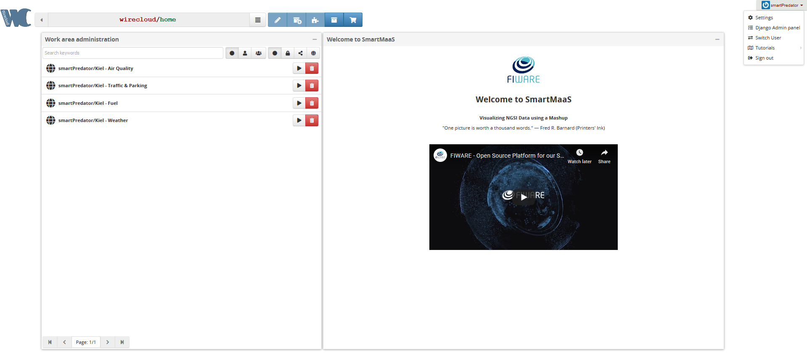

> To make changes on the starting page of wirecloud you have to switch the user:

    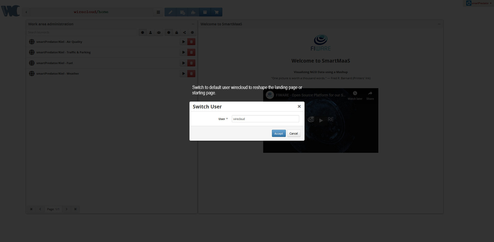

##### Wiring

    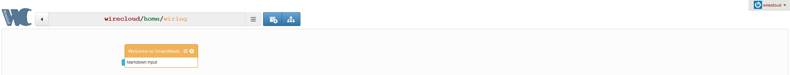

#### Kiel - Air Quality

##### Dashboard

    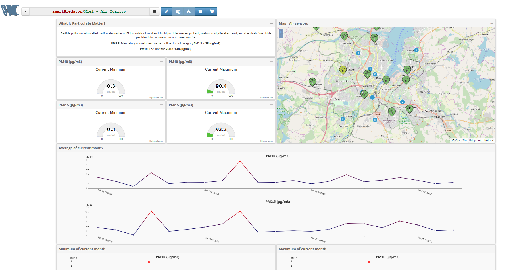

    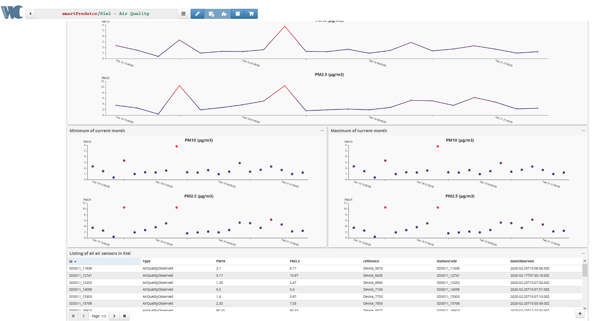

##### Wiring

    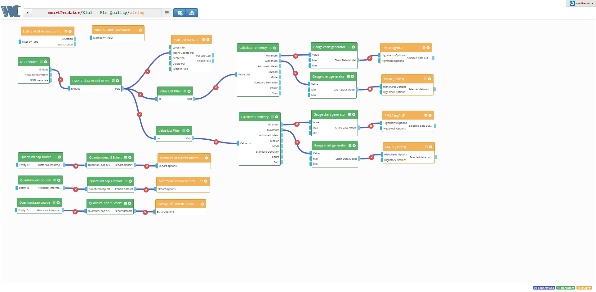

Settings screenshots can be found here: [Settings](https://github.com/SmartMaaS-Services/2019-wirecloud/tree/master/docs/img/kiel-air-quality-dashboard/settings)

#### Kiel - Parking and Traffic

##### Dashboard

    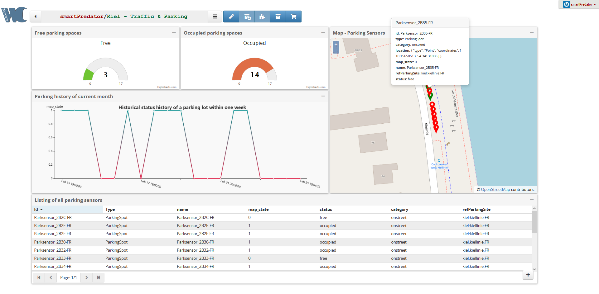

##### Wiring

    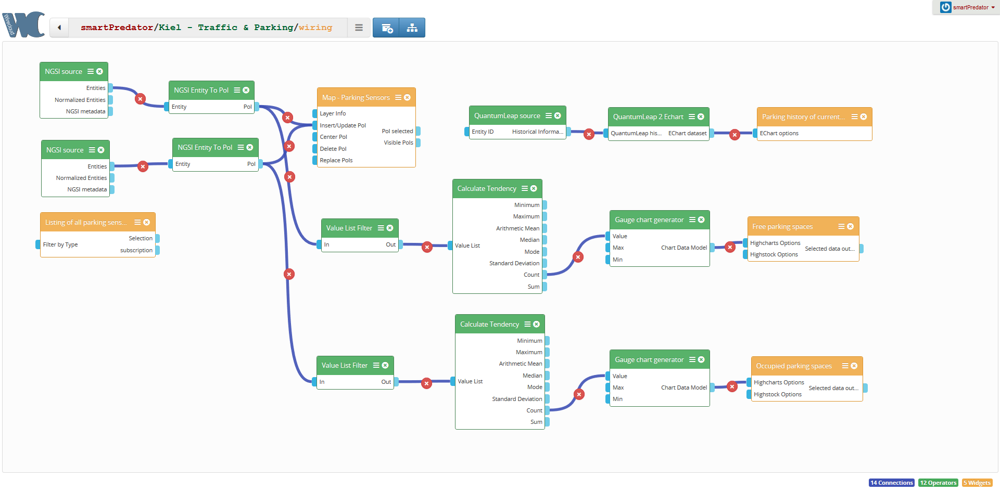

Settings screenshots can be found here: [Settings](https://github.com/SmartMaaS-Services/2019-wirecloud/tree/master/docs/img/kiel-parking-and-traffic-dashboard/settings)

#### Kiel - Weather Dashboard

##### Dashboard

    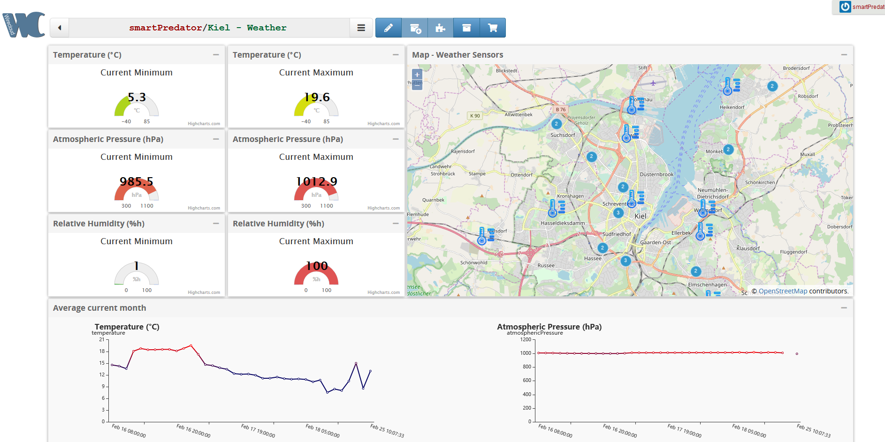

    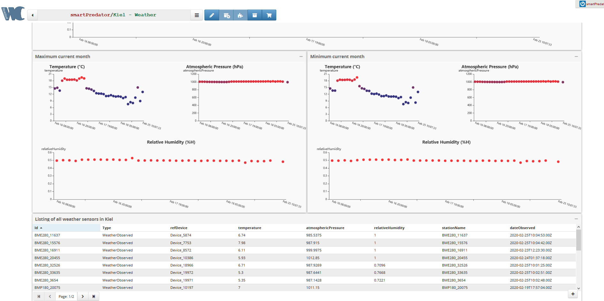

##### Wiring

    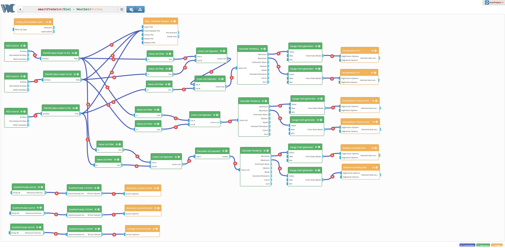

Settings screenshots can be found here: [Settings](https://github.com/SmartMaaS-Services/2019-wirecloud/tree/master/docs/img/kiel-weather-dashboard/settings)

#### Kiel - Fuel Dashboard

##### Dashboard

    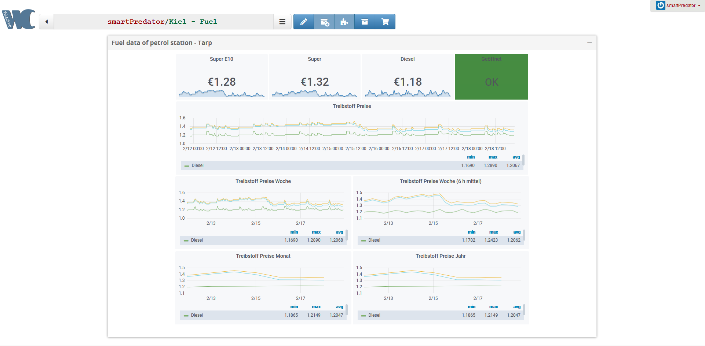

    

##### Wiring

    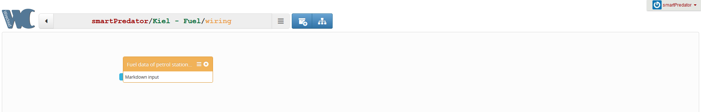

The widgets directory contains the operators and widgets that were used to implement and visualize the individual dashboards.

> Please note that some of the operators were **specially** adapted for the implementation and visualization of the open source data for Kiel. 
> For your own purposes please use the opators and widgets from the links below. 

## Operators and Widgets:

### Data acquisition
* [NGSI Source Operator](https://github.com/wirecloud-fiware/ngsi-source-operator)
    - Adapted version for SmartMaaS 2019 platform: [NGSI Source Operator](https://github.com/SmartMaaS-Services/ngsi-source-operator)
* [QuantumLeap Source Operator](https://github.com/Ficodes/quantumleap-source-operator)

### Data manipulation

##### Filter
* [Value List Filter Operator](https://github.com/Wirecloud/value-list-filter-operator)
* [Value Filter Operator](https://github.com/Wirecloud/value-filter-operator)

##### List Operation and statistics
* [Agile Dashboard Components](https://github.com/Wirecloud/agile-dashboards)
    - Adapted version of the `union-list-operator` for SmartMaaS 2019 platform: [Agile Dashboard Components](https://github.com/SmartMaaS-Services/agile-dashboards)
* [Calculator List Operator](https://github.com/lets-fiware/calculator-list-operator)

### Data model adapter (preparation of visualization)

##### Map data model adapter
* [NGSI Entity TO POI Operator](https://github.com/wirecloud-fiware/ngsi-entity2poi-operator)
    - Adapted version for SmartMaaS 2019 platform: [NGSI Entity TO POI Operator](https://github.com/SmartMaaS-Services/ngsi-entity2poi-operator)
* [NGSI Datamodel TO POI Operator](https://github.com/wirecloud-fiware/ngsi-datamodel2poi-operator)

##### Graph data model adapter
* [Gauge Chart Generator Operator](https://github.com/Wirecloud/gauge-chart-generator-operator)
* [QuantumLeap 2 Echart Operator](https://github.com/Ficodes/quantumleap-2-echart-operator)
* [Agile Dashboard Components](https://github.com/Wirecloud/agile-dashboards)

### Visualization

##### NGSI data
* [NGSI Browser Widget](https://github.com/wirecloud-fiware/ngsi-browser-widget)
    - Adapted version for SmartMaaS 2019 platform: [NGSI Browser Widget](https://github.com/SmartMaaS-Services/ngsi-browser-widget)
    

##### Map
* [Openlayers 3 Map Widget](https://github.com/Wirecloud/ol3-map-widget)
* [Leaflet Map Widget](https://github.com/SmartMaaS-Services/leaflet-map-widget) - Adapted version for SmartMaaS 2019 platform
##### Charts
* [Highcharts Widget](https://github.com/Wirecloud/highcharts-widget)
* [Echarts Widget](https://github.com/Wirecloud/echarts-widget)
* [Agile Dashboard Components](https://github.com/Wirecloud/agile-dashboards)

##### Editor
* [Markdown Editor Widget](https://github.com/Wirecloud/markdown-editor-widget)
* [JSON Editor Widget](https://github.com/Wirecloud/json-editor-widget)

##### Viewer
* [Markdown Viewer Widget](https://github.com/Wirecloud/markdown-viewer-widget)
* [Workspace Browser Widget](https://github.com/Wirecloud/workspace-browser-widget)

### New Operators

##### Accumulator
* [Generic Accumulator Operator](https://github.com/SmartMaaS-Services/generic-accumulator-operator)

##### GTFS Relationships Analyzer Operator (explizit for [vbb-rest-2-ngsi](https://github.com/SmartMaaS-Services/vbb-rest-2-ngsi))
* [GTFS Relationships Analyzer Operator](https://github.com/SmartMaaS-Services/gtfs-relationship-analyzer-operator)
 

